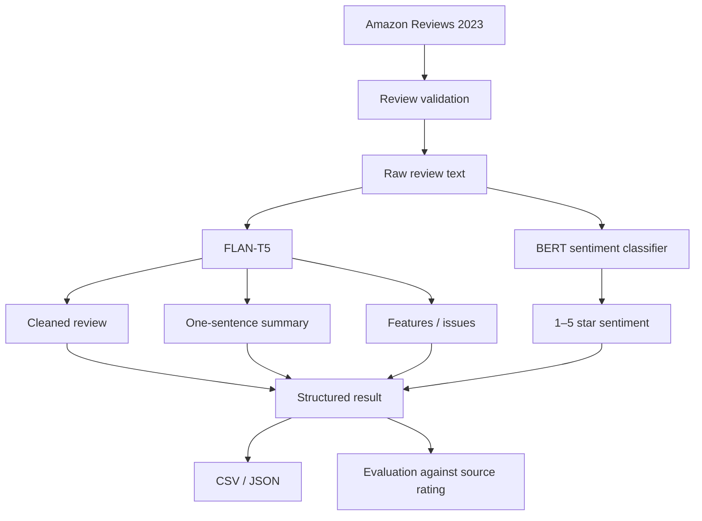

# GenAI Amazon Reviews

> Generative AI and NLP pipeline for transforming raw Amazon Video Game reviews into cleaned text, concise summaries, extracted product issues/features, and 1–5 star sentiment predictions.

[](https://perpsakach.github.io/)


## Overview

This project explores how pretrained transformer models can convert unstructured product-review text into structured analytical outputs without training a large language model from scratch.

Recovered project components include:

- Amazon Reviews 2023
- `raw_review_Video_Games`
- `raw_meta_Video_Games`
- `google/flan-t5-base`
- `nlptown/bert-base-multilingual-uncased-sentiment`

## Tasks

For each review, the pipeline produces:

1. cleaned/corrected text;
2. a one-sentence summary;
3. product features or issues;
4. 1–5 star sentiment;
5. structured source metadata for traceability.

## Architecture



## Recovered prompt design

```text
Clean and correct this product review: {text}
Summarize this review in one sentence: {text}
List the main product features or issues in this review: {text}
```

This demonstrates prompt-conditioned task switching: one sequence-to-sequence model performs several distinct transformations based on the instruction.

## Why two model families?

### FLAN-T5

Appropriate for generated-text tasks such as cleaning, summarization, and feature extraction.

### BERT sentiment classifier

Appropriate for a constrained ordinal classification task where the output belongs to a fixed 1–5 star label set.

Separating the two avoids using a generative model where a dedicated classifier is more direct and evaluable.

## Evaluation

The Amazon source data include an original rating, so sentiment predictions can be compared using:

- exact star accuracy;
- mean absolute error;
- within-one-star accuracy;
- confusion matrix;
- quadratic weighted kappa.

Generated summaries and feature extraction require a different evaluation strategy because valid human reference outputs are not automatically available.

## Repository structure

```text
src/
├── config.py
├── data_loader.py
├── genai_pipeline.py
└── evaluation.py

tests/
notebooks/
docs/
outputs/
```

## Quick start

```bash
pip install -r requirements.txt
python run_pipeline.py --limit 25 --output outputs/reviews.csv
```

The first run requires network access to download the dataset and pretrained models.

## Methodological limitations

- generative models can hallucinate unsupported content;
- long reviews may be truncated;
- numeric ratings and written sentiment may disagree;
- prompt wording can affect generated outputs;
- the sentiment model is not necessarily domain-trained specifically on this Amazon subset.

## Historical metric caution

A later portfolio summary associated an approximately 87% figure with text/GenAI work, but the original result artifact is not available. This repository does **not** present that number as a verified historical metric.

## Provenance

- **RECOVERED** — original dataset/model/prompt choices recovered from prior work
- **RECONSTRUCTED** — current modular implementation
- **ENHANCED** — validation, CLI, testing, and expanded evaluation
- **UNVERIFIED** — historical claims lacking a preserved result artifact

See [`PROVENANCE.md`](PROVENANCE.md).

## Portfolio

Explore the complete technical portfolio at **[perpsakach.github.io](https://perpsakach.github.io/)**.