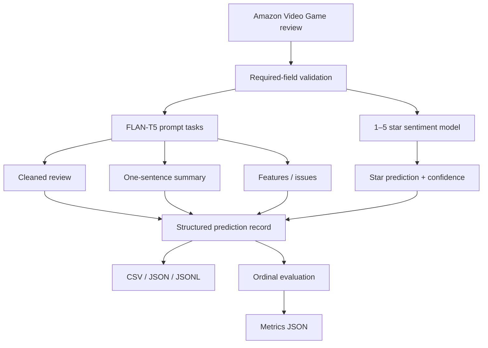

# GenAI Amazon Reviews

> Generative AI and NLP pipeline for transforming Amazon Video Game reviews into cleaned text, concise summaries, extracted product features/issues, and 1–5 star sentiment predictions.

[](https://github.com/PerpsAkach/genai-amazon-reviews/actions/workflows/ci.yml)
[](https://perpsakach.github.io/)


## Overview

This repository is a portfolio reconstruction of a prior Generative AI / NLP project built around Amazon Reviews 2023. The current implementation uses pretrained transformer models to convert unstructured review text into structured analytical outputs without claiming that the original historical source code has been recovered.

The default runtime uses:

- dataset family: `McAuley-Lab/Amazon-Reviews-2023`;
- review configuration: `raw_review_Video_Games`;
- text-generation model: `google/flan-t5-base`;
- sentiment model: `nlptown/bert-base-multilingual-uncased-sentiment`.

The recovered project context also includes `raw_meta_Video_Games`, but the current public runner does **not** join that metadata dataset.

Detailed boundaries: [`IMPLEMENTATION_STATUS.md`](IMPLEMENTATION_STATUS.md) · [`INPUT_CONTRACT.md`](docs/INPUT_CONTRACT.md) · [`OUTPUT_CONTRACT.md`](docs/OUTPUT_CONTRACT.md) · [`PROVENANCE.md`](PROVENANCE.md)

## Implemented workflow



## Prompt-conditioned tasks

The reconstructed prompt pattern is:

```text
Clean and correct this product review: {text}
Summarize this review in one sentence: {text}
List the main product features or issues in this review: {text}
```

One sequence-to-sequence model therefore performs several tasks based on the instruction supplied with the review text.

## Why two model families?

### FLAN-T5

Used for generated-text tasks: cleaning/correction, one-sentence summarization, and feature/issue extraction.

### BERT sentiment classifier

Used for a constrained ordinal task where the output belongs to a fixed 1–5 star label set. Keeping classification separate makes the sentiment output directly comparable with the source Amazon rating.

## Input validation and transformer limits

The pipeline requires non-empty review text and a finite numeric source rating in the inclusive range 1–5. Optional dataset sampling must use a positive integer limit.

Both model paths use **token-aware truncation**:

- FLAN-T5 inputs are tokenized with the configured `max_input_tokens`;
- sentiment inference is called with tokenizer truncation and the configured `sentiment_max_tokens`.

This avoids using character length as a proxy for transformer token limits.

## Structured traceability

When present in a source record, the public pipeline can preserve selected non-user fields such as ASIN, parent ASIN, title, timestamp, verified-purchase status, and helpful-vote count. Source user identifiers are intentionally not added to the structured output.

## Evaluation

The source rating supports direct ordinal evaluation of sentiment predictions. Implemented metrics are:

- exact star accuracy;
- within-one-star accuracy;
- mean absolute error;
- quadratic weighted kappa;
- a fixed-label 5×5 confusion matrix using star order `[1, 2, 3, 4, 5]`.

Generated cleaning, summaries, and feature/issue outputs are **not** assigned these metrics because the repository does not contain human-authored reference outputs for those tasks.

## Output formats

Prediction records can be written as:

```text
.csv
.json
.jsonl
.ndjson
```

Evaluation metrics are written separately as JSON. See [`docs/OUTPUT_CONTRACT.md`](docs/OUTPUT_CONTRACT.md) for the exact fields.

## Quick start

```bash
python -m pip install -r requirements.txt
python run_pipeline.py --limit 25 --output outputs/reviews.csv
```

The first real run requires network access unless the configured dataset and pretrained model assets are already cached locally.

A metrics document is created beside the prediction output by default:

```text
outputs/reviews.csv
outputs/reviews.metrics.json
```

Custom metrics path:

```bash
python run_pipeline.py \
  --limit 25 \
  --output outputs/reviews.jsonl \
  --metrics-output outputs/metrics.json
```

## Tests and CI

GitHub Actions validates the repository on Python 3.11, 3.12, and 3.13. The workflow performs:

```text
Dependency installation
        ↓
Source compilation
        ↓
Unit tests using deterministic model doubles
        ↓
CLI argument-surface validation

Ruff linting runs as a separate quality gate.
pip-audit runs as a separate dependency-security gate.
```

CI deliberately does not redownload and execute the large remote models/dataset on every run. Model objects are injectable, allowing local behavior to be tested deterministically without network access while preserving the real Hugging Face runtime path for actual inference.

Test coverage includes configuration validation, review validation, bounded dataset sampling, star-label parsing, injected-model execution, token-aware sentiment truncation, ordinal evaluation, confusion-matrix shape, and CSV/JSON/JSONL serialization.

## Repository structure

```text
.github/workflows/
└── ci.yml

docs/
├── INPUT_CONTRACT.md
└── OUTPUT_CONTRACT.md

src/
├── config.py
├── data_loader.py
├── evaluation.py
└── genai_pipeline.py

tests/
├── test_cli_outputs.py
├── test_config.py
├── test_data_loader.py
├── test_evaluation.py
└── test_pipeline.py

IMPLEMENTATION_STATUS.md
PROVENANCE.md
README.md
requirements.txt
run_pipeline.py
```

## Methodological and production limitations

- generative outputs can hallucinate, omit, or reframe details;
- prompt wording can affect generated outputs;
- the sentiment model is not represented as domain-fine-tuned on this Amazon subset;
- generated-text tasks do not yet have human-reference evaluation;
- the current public runner does not join the recovered metadata configuration;
- no hosted API, production inference service, registry, monitoring stack, or GPU deployment is included;
- upstream Hugging Face revisions are not pinned, so byte-for-byte remote artifact reproducibility is not guaranteed.

## Historical metric caution

A later portfolio summary associated an approximately **87%** figure with text/GenAI work, but the original result artifact is unavailable. This repository therefore does **not** present that figure as a verified historical result.

## Provenance

- **RECOVERED** — supported dataset/model/prompt choices from prior project context;
- **RECONSTRUCTED** — current modular implementation rebuilt where literal historical source bytes were unavailable;
- **ENHANCED** — validation, token handling, structured evaluation, serialization, tests, linting, dependency auditing, and CI;
- **UNVERIFIED** — historical claims lacking preserved evidence.

See [`PROVENANCE.md`](PROVENANCE.md) for the detailed boundary.

## Portfolio

Explore the complete technical portfolio at **[perpsakach.github.io](https://perpsakach.github.io/)**.
